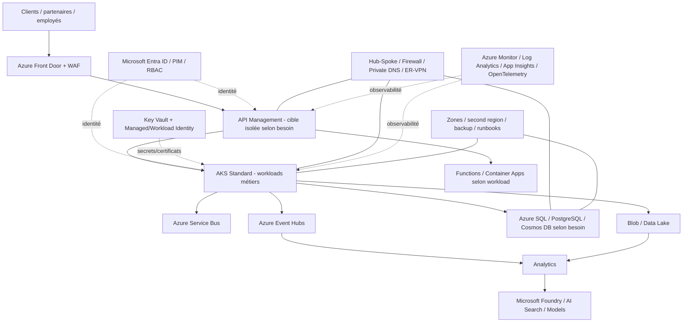

# MayaBank Azure Cloud & AI Platform

> Projet fil rouge **Architecte Solution Azure** pour une banque fictive : Landing Zone, identité, réseau, sécurité, AKS, API Management, event-driven, data, observabilité, résilience, FinOps/GreenOps, Microsoft Foundry et migration hybride.

## Objectif

Ce dépôt démontre le travail d'un Architecte Solution Azure de bout en bout :

`Besoin métier -> NFR -> principes -> Landing Zone -> sécurité -> réseau -> compute -> intégration -> data -> observabilité -> résilience -> coût -> IA -> migration -> soutenance`

Il ne s'agit pas seulement d'une préparation à AZ-305. Chaque décision importante doit être reliée à des exigences, alternatives, risques, ADR, IaC/lab et critères de validation.

Pour une présentation orientée entretien, commencer par [`PORTFOLIO.md`](PORTFOLIO.md).

## Architecture cible — synthèse



## État du parcours

| Itération | Domaine | Conception | Lab/code |
|---|---|---|---|
| 0 | Fondations | ✅ | ✅ |
| 1 | Azure Landing Zone | ✅ | ✅ Terraform Policy/ALZ |
| 2 | Identity & Security | ✅ | ✅ Terraform lab faible coût |
| 3 | Networking | ✅ | ✅ Terraform Hub-Spoke lab |
| 4 | AKS | ✅ | 🧪 lab à exécuter à la demande |
| 5 | API Management | ✅ | ✅ contrat OpenAPI + policy ; déploiement Azure à exécuter |
| 6 | Event-driven | ✅ | ✅ pattern retry/DLQ/idempotence ; runtime à exécuter |
| 7 | Data | ✅ | ✅ Terraform Storage lab |
| 8 | Observability | ✅ | ✅ Terraform Log Analytics lab |
| 9 | HA / DR | ✅ | ✅ matrice RTO/RPO + runbook ; exercice runtime à exécuter |
| 10 | FinOps / GreenOps | ✅ | ✅ guardrails + routine de contrôle |
| 11 | Microsoft Foundry / AI | ✅ | 🧪 RAG lab selon quota |
| 12 | Migration OpenShift -> Azure | ✅ | ✅ matrice ARO/AKS/PaaS + scénario pilote |
| 13 | Soutenance Architecte | ✅ | ✅ portfolio + challenge entretien |

**Les itérations 0 à 13 sont terminées au niveau conception.** Les labs Azure nécessitant un abonnement authentifié ne sont volontairement pas marqués comme exécutés tant qu'aucun `apply` et aucune preuve de test n'ont été produits.

### Hardening Architecte Azure 2026

Le dépôt a également reçu une passe de finalisation basée sur les références publiques Microsoft actuelles :

- **I1** — Azure Landing Zones + AVM + bootstrap remote state + OIDC : terminé ;
- **I2** — Identity/Security + Hub-Spoke/Private networking : terminé ;
- **I3** — AKS enterprise baseline + checklist de preuves : terminé côté conception ;
- **I4** — architecture paiement APIM + OpenAPI + event-driven/idempotence : terminé côté conception/artefacts ;
- **I5** — Data + Observability + HA/DR + runbook : terminé côté conception/artefacts ;
- **I6** — AI Landing Zone + migration OpenShift + FinOps/GreenOps : terminé côté conception ;
- **I7** — CI, portfolio et soutenance : terminé.

La frontière restante est volontaire : **déploiements Azure et preuves runtime**.

## Documentation

```text
docs/
├── 00-roadmap.md
├── 01-business-context/
├── 02-architecture-principles/
├── 03-azure-landing-zone/
├── 04-identity-entra/
├── 05-networking/
├── 07-aks/
├── 08-api-management/
├── 09-event-driven/
├── 10-data/
├── 11-observability/
├── 12-ha-dr/
├── 13-finops-greenops/
├── 14-ai-platform/
├── 15-migration/
└── 16-soutenance/
```

Les décisions structurantes sont centralisées dans `architecture/adr/ADR-CATALOG.md`. Les procédures opérationnelles sont placées dans `runbooks/`.

## Labs

Le catalogue complet est dans `labs/LAB-CATALOG.md`.

Terraform déjà fourni pour les labs les moins coûteux :

- `lab-01-landing-zone` — Azure Policy / gouvernance ;
- `lab-02-identity` — Managed Identity + Key Vault + RBAC ;
- `lab-03-network` — Hub-Spoke + NSG + Private DNS ;
- `lab-07-data` — Storage security baseline ;
- `lab-08-observability` — Log Analytics baseline.

AKS, APIM, multi-région et Microsoft Foundry sont créés uniquement pendant les sessions qui les nécessitent afin d'éviter une facture permanente.

## Validation CI

`.github/workflows/terraform-validate.yml` vérifie les roots Terraform avec :

```bash
terraform fmt -check -diff -recursive
terraform init -backend=false
terraform validate
```

La validation statique ne remplace pas un `terraform plan/apply` authentifié ni les tests runtime. Les preuves d'exécution Azure doivent être conservées dans les dossiers `evidence/` des labs concernés.

## Principes

- Architecture avant technologie.
- Azure Well-Architected Framework : Reliability, Security, Cost Optimization, Operational Excellence, Performance Efficiency.
- Private by default pour les données/services sensibles.
- Zero Trust et least privilege.
- Managed Identity / Workload Identity avant secrets statiques.
- Terraform + Azure Verified Modules prioritaire.
- Policy as Code.
- Observability by design avec OpenTelemetry.
- RTO/RPO métier avant design DR.
- FinOps/GreenOps by design.
- Labs reproductibles, vérifiables et destructibles.

## Références principales

- `Azure/Azure-Landing-Zones`
- `Azure/terraform-azurerm-avm-ptn-alz`
- `Azure/alz-terraform-accelerator`
- `MicrosoftDocs/architecture-center`
- `Azure-Samples/azure-hub-spoke`
- `Azure/AKS-Landing-Zone-Accelerator`
- `mspnp/aks-baseline`
- `Azure/apim-landing-zone-accelerator`
- `Azure/AI-Landing-Zones`
- `Azure/DevOps-Landing-Zone`

## Budget pédagogique

Le dépôt sépare **cible entreprise** et **lab économique**. Azure Firewall, Bastion, APIM à tier élevé, AKS multi-zone/multi-région, grosses bases et plateformes IA ne doivent pas rester déployés pour un exercice ponctuel.

## Suite pratique

La phase suivante n'est plus d'ajouter des chapitres : elle consiste à **exécuter les labs dans l'ordre, conserver les preuves, mesurer les coûts et corriger l'architecture à partir des résultats observés**.
