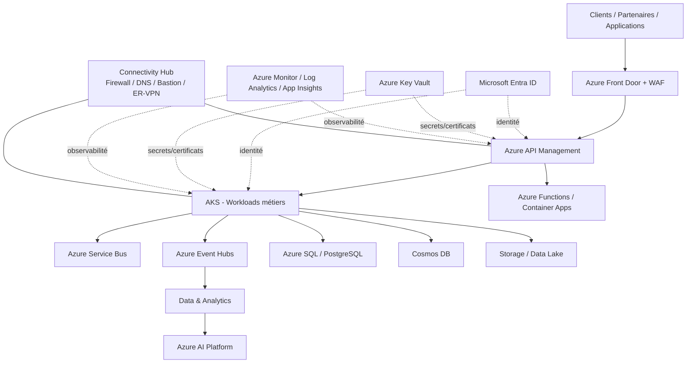

# MayaBank Azure Cloud & AI Platform

> Projet fil rouge d'architecture solution Azure pour une banque fictive : Landing Zone, identité, réseau, sécurité, AKS, API Management, intégration événementielle, data, observabilité, résilience, FinOps/GreenOps et IA.

## Objectif

Ce dépôt sert à apprendre et démontrer le travail d'un **Architecte Solution Azure** de bout en bout : partir d'exigences métier et non fonctionnelles, définir une architecture cible, justifier les choix, automatiser l'infrastructure, déployer des POC, tester la résilience/sécurité et documenter les décisions.

Il ne s'agit pas d'un simple dépôt de préparation à une certification. Chaque domaine doit produire :

1. un besoin et des exigences ;
2. une architecture et ses alternatives ;
3. des ADR ;
4. de l'IaC reproductible ;
5. un lab exécutable ;
6. des contrôles de validation ;
7. une procédure de destruction pour maîtriser les coûts.

## Architecture cible — vue logique



Cette vue évoluera au fil des ADR et des labs. Elle n'est pas une architecture finale figée.

## Structure du dépôt

```text
mayabank-azure-cloud-ai-platform/
├── docs/
│   ├── 00-roadmap.md
│   ├── 01-business-context/
│   ├── 02-architecture-principles/
│   ├── 03-azure-landing-zone/
│   ├── 04-identity-entra/
│   ├── 05-networking/
│   ├── 06-security/
│   ├── 07-aks/
│   ├── 08-api-management/
│   ├── 09-event-driven/
│   ├── 10-data/
│   ├── 11-observability/
│   ├── 12-ha-dr/
│   ├── 13-finops-greenops/
│   ├── 14-ai-platform/
│   └── 15-architecture-decisions/
├── architecture/
│   ├── diagrams/
│   └── adr/
├── infrastructure/
│   ├── terraform/
│   └── bicep/
├── platform/
│   ├── aks/
│   ├── apim/
│   ├── event-hubs/
│   ├── service-bus/
│   └── ai/
├── security/
├── observability/
├── labs/
├── cost/
└── interview/
```

## Parcours

| Itération | Sujet | Livrable principal |
|---|---|---|
| 0 | Fondations | contexte, principes, roadmap, ADR, structure |
| 1 | Azure Landing Zone | management groups, subscriptions, policies, tagging |
| 2 | Identity & Security | Entra ID, RBAC, PIM, Managed Identities, Key Vault |
| 3 | Networking | Hub-Spoke, Firewall, DNS privé, Private Endpoints, ER/VPN |
| 4 | AKS | cluster privé, ingress, identité, storage, autoscaling |
| 5 | API Management | exposition d'API, policies, sécurité, private networking |
| 6 | Event-driven | Service Bus, Event Hubs, patterns d'intégration |
| 7 | Data | Azure SQL/PostgreSQL, Cosmos DB, Storage/Data Lake |
| 8 | Observability | Monitor, Log Analytics, Application Insights, alerting |
| 9 | HA/DR | zones, régions, backup, RTO/RPO, exercices de reprise |
| 10 | FinOps/GreenOps | budgets, tagging, sizing, arrêt/destruction, optimisation |
| 11 | AI Platform | Azure AI, AI Search, RAG, sécurité et gouvernance IA |
| 12 | Migration | trajectoire on-prem/OpenShift vers Azure |
| 13 | Soutenance | dossier d'architecture + questions d'entretien |

## Principes de travail

- **Architecture avant technologie** : besoin, contraintes et NFR avant choix de services.
- **Private by default** : accès privé dès que pertinent ; exposition publique explicitement justifiée.
- **Zero Trust** : vérification explicite, moindre privilège, identité de workload.
- **Everything as Code** : Terraform prioritaire ; Bicep conservé pour comparaison et compréhension Azure native.
- **Policy as Code** : gouvernance contrôlée et versionnée.
- **Observability by design** : logs, métriques, traces, SLO et alertes conçus avec le workload.
- **Resilience by design** : RTO/RPO et modes dégradés définis avant la production.
- **FinOps/GreenOps by design** : coût et consommation évalués avant chaque déploiement.
- **Destroyable labs** : aucun lab ne doit laisser des ressources coûteuses sans procédure de destruction.

## Références principales

Les implémentations s'inspireront des références Microsoft actuelles sans les recopier aveuglément :

- Azure Landing Zones — `Azure/Azure-Landing-Zones`
- Azure Architecture Center — `MicrosoftDocs/architecture-center`
- AVM Platform Landing Zone Terraform — `Azure/terraform-azurerm-avm-ptn-alz`
- Hub-Spoke — `Azure-Samples/azure-hub-spoke`
- AKS Landing Zone Accelerator — `Azure/AKS-Landing-Zone-Accelerator`
- API Management Landing Zone Accelerator — `Azure/apim-landing-zone-accelerator`
- AI Landing Zones — `Azure/AI-Landing-Zones`

## Budget de lab

Le projet doit rester compatible avec un **petit budget Azure**. Les composants coûteux seront soit déployés à la demande, soit simulés, soit documentés sans exécution permanente. Chaque lab comportera une section `destroy` et un contrôle du coût attendu.

## État

**Itération 0 — terminée.**

Prochaine étape : **Itération 1 — Azure Landing Zone**, avec management groups, subscriptions, Azure Policy, tagging, budgets et première implémentation Terraform/AVM.
