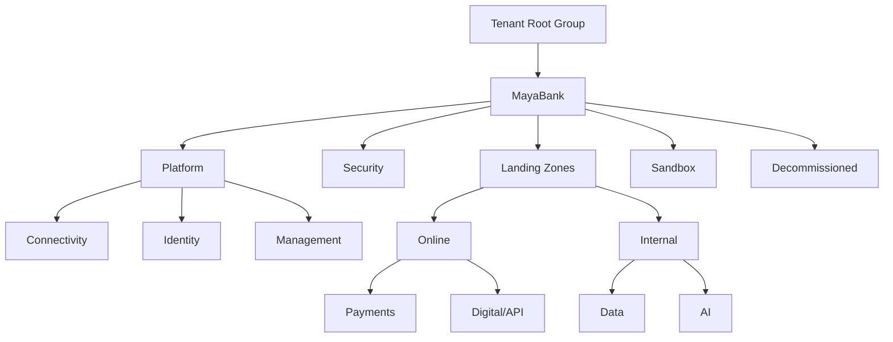

# Iteration 1 — Azure Landing Zone

## Objectif

Concevoir la fondation Azure de MayaBank avant tout déploiement applicatif. La Landing Zone doit permettre de gouverner plusieurs workloads et environnements sans dupliquer les contrôles.

## Modèle cible

MayaBank retient deux niveaux complémentaires :

- **Platform Landing Zone** : gouvernance, identité, connectivité, sécurité, supervision et services partagés.
- **Application Landing Zones** : espaces délégués aux workloads métier, avec héritage des policies et contrôles de la plateforme.

## Hiérarchie cible des Management Groups



## Subscriptions cibles

| Subscription | Management Group | Usage |
|---|---|---|
| `sub-mbk-connectivity-prod` | Connectivity | hub réseau, firewall, DNS, ER/VPN |
| `sub-mbk-identity-prod` | Identity | composants d'identité dédiés si requis |
| `sub-mbk-management-prod` | Management | observabilité, automation, services de management |
| `sub-mbk-security-prod` | Security | Sentinel et outillage sécurité central |
| `sub-mbk-payments-nonprod` | Online/Payments | DEV/TEST/PREPROD paiements |
| `sub-mbk-payments-prod` | Online/Payments | production paiements |
| `sub-mbk-data-nonprod` | Internal/Data | data non-prod |
| `sub-mbk-data-prod` | Internal/Data | data production |
| `sub-mbk-ai-nonprod` | Internal/AI | POC et workloads IA non-prod |
| `sub-mbk-ai-prod` | Internal/AI | workloads IA production |

La séparation exacte dépendra des contraintes réglementaires, d'exploitation, de facturation et de limites Azure. Le lab personnel n'a pas besoin de reproduire dix subscriptions.

## Variante de lab économique

Pour un abonnement Azure personnel :

```text
1 tenant Entra
└── 1 subscription de lab
    ├── rg-mbk-platform-lab
    ├── rg-mbk-network-lab
    ├── rg-mbk-security-lab
    └── rg-mbk-workload-lab
```

Cette variante sert à apprendre les concepts. Elle ne remplace pas la cible entreprise multi-subscriptions.

## Décisions d'architecture

1. Les workloads ne sont pas déployés directement dans les subscriptions de plateforme.
2. Les policies structurantes sont assignées au niveau Management Group quand elles doivent être héritées.
3. Les permissions des équipes applicatives sont accordées au niveau subscription ou Resource Group, pas au niveau racine de la Landing Zone.
4. Les ressources publiques sont interdites par défaut quand une option privée appropriée existe.
5. Les environnements PROD et NON-PROD sont séparés au minimum par subscription pour les workloads critiques.
6. Les tags obligatoires sont contrôlés par Azure Policy.
7. Les coûts sont suivis dès la création d'une subscription ou d'un Resource Group.
8. Terraform et Azure Verified Modules sont l'implémentation IaC principale.

## Critères de fin de l'itération

- hiérarchie cible documentée ;
- modèle de subscriptions documenté ;
- conventions de nommage et tagging définies ;
- baseline de policies définie ;
- squelette Terraform/AVM présent ;
- lab avec `plan`, `apply`, contrôles et `destroy` documenté ;
- différences entre cible entreprise et lab personnel explicites.
