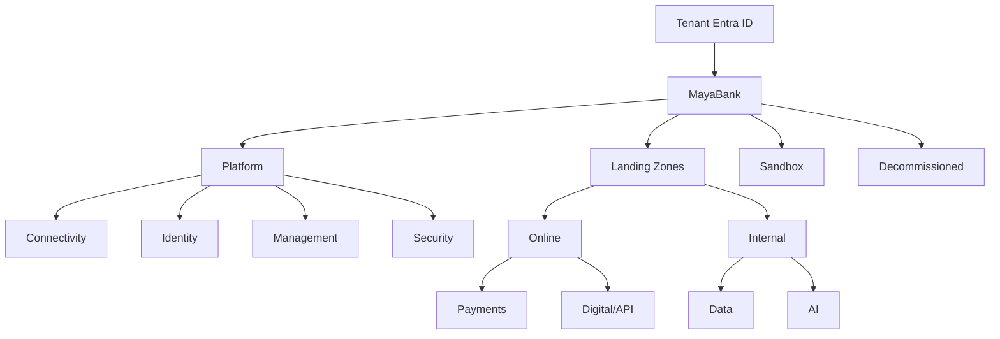

# MayaBank Azure Landing Zone — référence d'implémentation 2026

## Positionnement

Cette note fixe le socle de référence de la Landing Zone MayaBank. Elle évite de dupliquer les implémentations Microsoft et distingue clairement :

- la **cible entreprise** multi-subscriptions ;
- le **lab pédagogique** à coût limité ;
- les composants de **plateforme** ;
- les **Application Landing Zones** consommées par les workloads.

## Références publiques retenues

| Référence | Usage MayaBank | Décision |
|---|---|---|
| `Azure/Azure-Landing-Zones` | architecture conceptuelle ALZ | référence principale |
| `Azure/terraform-azurerm-avm-ptn-alz` | Management Groups, Policy, rôles | module ALZ principal |
| `Azure/alz-terraform-accelerator` | bootstrap, séparation des stages, CI/CD | modèle d'industrialisation |
| `Azure-Samples/azure-hub-spoke` | réseau hub-spoke | référence réseau |
| `Azure/AKS-Landing-Zone-Accelerator` | Application Landing Zone AKS | référence workload |
| `mspnp/aks-baseline` | baseline AKS sécurisée | référence de conception AKS |
| `Azure/apim-landing-zone-accelerator` | APIM privé et gouverné | référence API |
| `Azure/AI-Landing-Zones` | plateforme IA gouvernée | référence AI |
| `Azure/DevOps-Landing-Zone` | OIDC, runners, state et pipelines | référence DevSecOps |

## Références historiques

Les anciennes implémentations `terraform-azurerm-caf-enterprise-scale` et ALZ Bicep Classic restent utiles pour comprendre l'historique mais ne sont pas retenues comme socle de nouveau code MayaBank. La direction retenue est **Azure Landing Zones + Azure Verified Modules + ALZ Terraform Accelerator**.

## Cible d'entreprise



### Platform Landing Zone

Responsabilités :

- Management Groups et placement des subscriptions ;
- Azure Policy et initiatives ;
- connectivité partagée ;
- identité et délégation ;
- observabilité centrale ;
- sécurité centrale ;
- budgets, tags et gouvernance ;
- état Terraform et identité des pipelines.

### Application Landing Zones

Chaque workload reçoit une subscription ou un ensemble de subscriptions selon criticité et séparation PROD/NON-PROD. Le workload hérite des contrôles de la plateforme mais garde son propre cycle de livraison.

## Séparation des états Terraform

Un état unique pour toute la banque est interdit. Le découpage cible est :

```text
state/
├── bootstrap
├── alz-platform
├── connectivity
├── identity
├── management
├── security
├── payments-nonprod
├── payments-prod
├── data
└── ai
```

Cette séparation limite le blast radius, les verrous concurrents et les permissions excessives.

## Authentification des pipelines

La cible CI/CD utilise **OpenID Connect / Workload Identity Federation**. Aucun secret de Service Principal longue durée ne doit être stocké dans GitHub Actions.

Flux cible :

```text
GitHub Actions
    |
    | OIDC
    v
Microsoft Entra ID
    |
    v
identité fédérée à privilèges minimaux
    |
    v
Terraform plan/apply
```

## Gouvernance du déploiement

Ordre logique :

1. `bootstrap` — remote state et identités de déploiement ;
2. `alz-platform` — Management Groups, Policy, rôles ;
3. `connectivity` — hub, DNS, Firewall, ER/VPN ;
4. `management/security` — logs, Defender/Sentinel selon cible ;
5. `application landing zones` — subscriptions et contrôles workload ;
6. workloads : Payments, Data, AI.

## Quality gates

Chaque root module Terraform doit passer au minimum :

```bash
terraform fmt -check -recursive
terraform init -backend=false
terraform validate
terraform plan
```

Puis, dans la CI cible :

- lint Terraform ;
- scan IaC ;
- détection de secrets ;
- estimation de coût lorsque pertinente ;
- approbation protégée avant `apply` de production ;
- conservation du plan et des preuves de validation.

## Definition of Done I1

L'itération I1 est terminée lorsque :

- les références Microsoft 2026 sont explicites ;
- AVM est le choix IaC principal ;
- la séparation Platform/Application Landing Zones est documentée ;
- le modèle d'état distant est documenté ;
- OIDC remplace les secrets permanents dans la cible CI/CD ;
- le root module ALZ est versionné et validable ;
- la cible entreprise est distinguée du lab économique ;
- les étapes suivantes Connectivity, Identity/Security et workloads sont clairement séparées.
