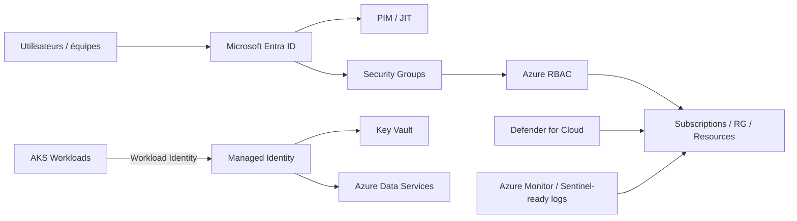

# Itération 2 — Identity & Security

## Objectif

Définir une architecture d'identité et de sécurité Azure adaptée à une banque fictive : moindre privilège, séparation des responsabilités, authentification forte, identités de workload et secrets hors du code.

## Architecture cible

## Décisions

- Comptes humains : Microsoft Entra ID, MFA/Conditional Access gérés au niveau tenant.
- Autorisations Azure : groupes Entra + Azure RBAC, pas d'attributions directes aux utilisateurs sauf break-glass documenté.
- Privilèges élevés : PIM/JIT avec durée limitée, justification et audit.
- Workloads : Managed Identities et Workload Identity ; aucun secret statique dans GitHub ou Kubernetes Secret si une identité fédérée est possible.
- Secrets/certificats : Azure Key Vault avec RBAC, soft delete et purge protection en production.
- Séparation : Platform, Security, Network, Application Owner, Reader/Auditor.
- Defender for Cloud activé selon niveau de risque et budget ; recommandations intégrées au backlog de sécurité.

## Matrice RBAC simplifiée

| Persona | Scope | Rôle cible |
|---|---|---|
| Platform Admin | Platform subscriptions | Contributor + rôles spécialisés via PIM |
| Network Admin | Connectivity subscription | Network Contributor via PIM |
| Security | Tenant/subscriptions | Security Admin/Reader selon tâche |
| App Team | Application RG/subscription | Contributor sans gestion RBAC |
| Auditor | Management group | Reader / Security Reader |
| CI/CD | Scope minimum requis | identité fédérée GitHub OIDC + rôle spécifique |

## Contrôles

1. Pas de Owner permanent pour les équipes applicatives.
2. Pas de client secret longue durée pour CI/CD.
3. Logs d'activité conservés et centralisés.
4. Key Vault en accès public désactivé en production lorsque le scénario le permet.
5. Rotation et expiration documentées pour les certificats qui ne peuvent pas être remplacés par une identité managée.

## LAB 02 — économique

Le lab doit créer :
- un Resource Group ;
- une User Assigned Managed Identity ;
- un Key Vault ;
- une attribution RBAC limitée ;
- une validation d'accès ;
- puis destruction complète.

Aucune VM n'est requise.

## Questions de soutenance

- Différence entre Entra RBAC et Azure RBAC ?
- Pourquoi préférer Workload Identity à un secret Kubernetes ?
- Comment gérer un accès d'urgence ?
- Pourquoi PIM est-il important dans une banque ?
- À quel scope attribuer un rôle : management group, subscription, RG ou resource ?

## Definition of Done

- architecture d'identité documentée ;
- matrice RBAC ;
- principes PIM/JIT ;
- stratégie Managed Identity/Workload Identity ;
- Key Vault ;
- lab sans compute coûteux ;
- contrôles positifs/négatifs et destroy documentés.
