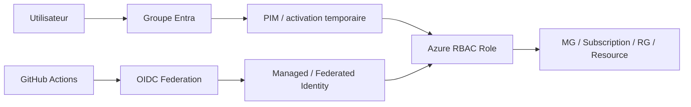

# MayaBank — Enterprise Identity & Security Baseline

## Objectif

Définir le modèle cible d'identité et de sécurité pour la plateforme Azure MayaBank. Le principe central est **Zero Trust + least privilege + identité managée avant secret**.

## Principes

1. Microsoft Entra ID est le plan de contrôle d'identité.
2. Les accès humains utilisent des groupes, jamais des attributions individuelles permanentes sauf compte d'urgence.
3. Les rôles privilégiés sont éligibles via PIM lorsque le service et la licence le permettent.
4. Les workloads utilisent Managed Identity ou Workload Identity Federation.
5. Les pipelines GitHub utilisent OIDC ; aucun secret de Service Principal longue durée n'est la cible.
6. Les secrets applicatifs restants sont centralisés dans Key Vault.
7. Les permissions sont accordées au scope le plus petit compatible avec l'exploitation.
8. Les accès de production sont séparés des accès de build/non-production.

## Modèle des personas

| Persona | Scope | Accès cible |
|---|---|---|
| Platform Architect | Management Groups / plateforme | lecture globale, conception, accès privilégié temporaire |
| Platform Operator | subscriptions plateforme | Contributor ciblé, rôles spécialisés |
| Security Operator | sécurité / logs / Defender | rôles sécurité dédiés |
| Network Operator | connectivity | Network Contributor ciblé |
| Application Team | subscription workload | Contributor sans gouvernance tenant |
| Auditor | scopes requis | Reader / Security Reader |
| CI/CD | root Terraform concerné | identité fédérée et rôle minimal |

## Modèle RBAC



### Règles

- `Owner` est exceptionnel et contrôlé.
- préférer les rôles spécialisés (`Network Contributor`, `Key Vault Secrets User`, etc.) à `Contributor` lorsque possible ;
- les rôles custom ne sont créés que lorsqu'aucun rôle built-in ne répond au besoin ;
- toutes les attributions privilégiées ont un propriétaire métier/technique et une justification.

## PIM

Pour les rôles critiques :

- activation à durée limitée ;
- MFA / Conditional Access selon politique entreprise ;
- justification obligatoire ;
- approbation pour les privilèges les plus sensibles ;
- revue périodique des éligibilités.

Le dépôt ne tente pas de simuler les licences Entra nécessaires dans le lab personnel : il documente la cible entreprise.

## Workload Identity

Ordre de préférence :

1. Managed Identity ;
2. Workload Identity Federation ;
3. certificat géré et roté ;
4. secret uniquement si aucune alternative n'existe.

### Kubernetes / AKS

```text
Pod
  |
ServiceAccount Kubernetes
  |
OIDC federation
  |
Managed Identity / App Registration
  |
Azure RBAC
  |
Key Vault / Storage / Service Bus / autre ressource
```

Aucun secret Azure longue durée ne doit être injecté dans un pod lorsque Workload Identity répond au besoin.

## Key Vault

Cible entreprise :

- RBAC Azure activé ;
- Private Endpoint ;
- accès public désactivé quand les flux privés sont opérationnels ;
- purge protection activée en production ;
- diagnostic settings vers la plateforme de logs ;
- séparation des coffres selon environnement et frontière de sécurité ;
- rotation documentée.

Le lab `lab-02-identity` reste volontairement moins strict sur le réseau pour pouvoir être exécuté depuis un abonnement personnel à faible coût.

## Comptes d'urgence

La cible prévoit des comptes d'accès d'urgence séparés des comptes nominatifs usuels :

- contrôlés et surveillés ;
- credentials protégés hors du flux d'authentification habituel ;
- testés périodiquement ;
- utilisation générant une alerte prioritaire.

## Sécurité des pipelines

GitHub Actions cible :

```text
GitHub repository
    |
protected environment
    |
OIDC token court
    |
Entra federated credential
    |
Azure RBAC minimal
    |
Terraform root ciblé
```

Règles :

- `permissions: contents: read` par défaut ;
- `id-token: write` uniquement pour les workflows qui s'authentifient réellement sur Azure ;
- environnements GitHub protégés pour production ;
- plan relu avant apply ;
- secrets masqués et limités au strict nécessaire.

## Contrôles à démontrer

- Managed Identity créée et visible ;
- attribution RBAC ciblée ;
- Key Vault en mode RBAC ;
- aucune clé/secret dans Git ;
- modèle OIDC documenté ;
- matrice personas/scopes disponible ;
- différence lab vs cible production explicite.
