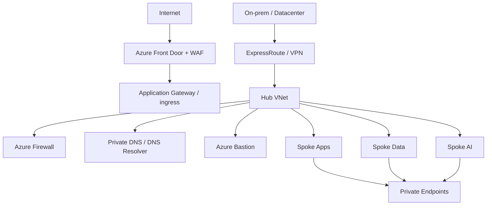

# Itération 3 — Network Foundation

## Objectif

Construire la fondation réseau Azure de MayaBank avec segmentation, contrôle des flux, connectivité hybride et exposition maîtrisée.

## Cible entreprise

## Principes

- Hub-Spoke pour séparer services partagés et workloads.
- Azure Firewall en cible entreprise pour inspection et egress centralisé ; non déployé en permanence dans les labs pour raisons de coût.
- NSG sur subnets et segmentation minimale par fonction.
- UDR lorsque le trafic doit transiter par le firewall/NVA.
- Private Link / Private Endpoints pour PaaS sensibles.
- Private DNS centralisé ; éviter les zones DNS dupliquées par application.
- ExpressRoute pour la cible bancaire hybride ; VPN S2S comme solution de lab ou secours selon besoin.
- Front Door pour l'entrée globale et WAF ; Application Gateway lorsque le contrôle L7 régional/ingress est requis.
- Aucun service PaaS sensible ne doit être rendu public par défaut.

## Plan IP de référence

| Zone | CIDR exemple |
|---|---|
| Hub | 10.10.0.0/16 |
| Apps Spoke | 10.20.0.0/16 |
| Data Spoke | 10.30.0.0/16 |
| AI Spoke | 10.40.0.0/16 |
| DR region | 10.110.0.0/16 et suivants |

Les CIDR sont pédagogiques et doivent être validés contre le plan IP d'entreprise avant production.

## Flux critiques

- Internet -> Front Door/WAF -> APIM/Ingress : TLS uniquement.
- Workload -> Key Vault/Data : Private Endpoint + DNS privé.
- On-prem -> Azure : ExpressRoute/VPN, routes explicitement contrôlées.
- Spoke -> Spoke : via architecture de transit définie ; pas de peering anarchique.
- Egress Internet : allow-list et journalisation en production.

## LAB 03 — économique

Déployer uniquement :
- 1 VNet hub ;
- 2 VNets spoke ;
- subnets ;
- NSG ;
- peerings ;
- Private DNS Zone de démonstration ;
- aucune VM, aucun Firewall, aucun Bastion permanent.

Valider les routes et la topologie avec Azure CLI, puis `terraform destroy`.

## Questions de soutenance

- Hub-Spoke ou Virtual WAN : comment choisir ?
- Private Endpoint vs Service Endpoint ?
- Front Door vs Application Gateway ?
- Pourquoi le DNS devient-il critique avec Private Link ?
- Où place-t-on l'inspection du trafic est-ouest et nord-sud ?

## Definition of Done

Topologie, plan IP, flux, DNS, hybridation, sécurité réseau, IaC/lab économique et stratégie de destruction documentés.
