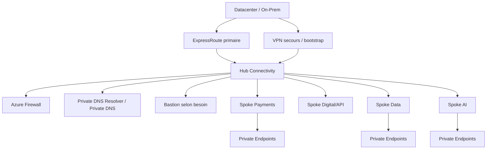

# MayaBank — Enterprise Connectivity Baseline

## Objectif

Définir la connectivité cible de la plateforme Azure MayaBank pour les workloads bancaires : segmentation, flux privés, inspection, résolution DNS et hybridation datacenter/Azure.

## Architecture cible



## Principes

1. Hub-Spoke est le modèle de référence du dépôt pour les scénarios pédagogiques et la cible initiale.
2. La plateforme centralise la connectivité, le DNS privé et les contrôles réseau partagés.
3. Les workloads restent dans leurs spokes/Application Landing Zones.
4. Les données et services sensibles sont **private by default**.
5. Le trafic inter-spokes n'est pas implicitement autorisé.
6. Les flux nécessaires sont documentés dans une matrice source/destination/port/protocole/justification.
7. Les plages IP sont planifiées avant création des VNets pour éviter les recouvrements avec l'on-premise.

## Plan d'adressage de référence

Exemple documentaire :

| Zone | CIDR exemple | Usage |
|---|---|---|
| Hub | `10.10.0.0/16` | services réseau partagés |
| Payments | `10.20.0.0/16` | paiement/API métier |
| Data | `10.30.0.0/16` | data services |
| AI | `10.40.0.0/16` | workloads IA |
| Management | `10.50.0.0/16` | observabilité/ops si séparé |

Ces CIDR sont des exemples de lab et doivent être remplacés par un IPAM validé dans une vraie entreprise.

## ExpressRoute / VPN

Cible banque :

- ExpressRoute pour les flux hybrides structurants lorsque les exigences de connectivité le justifient ;
- redondance physique/logique adaptée à la criticité ;
- VPN comme solution de bootstrap ou de secours selon architecture ;
- BGP et routes validés avec l'équipe réseau ;
- tests de perte d'un chemin documentés.

## Azure Firewall et routage

Pour les environnements nécessitant inspection centralisée :

```text
Spoke subnet
  |
UDR 0.0.0.0/0 / routes privées ciblées
  |
Azure Firewall
  |
Internet / On-Prem / autre zone autorisée
```

Décisions à documenter :

- egress Internet autorisé ou non ;
- FQDN/application rules ;
- règles réseau ;
- SNAT/DNAT ;
- journalisation ;
- exceptions et propriétaires.

Azure Firewall n'est pas laissé actif en permanence dans le lab personnel en raison de son coût.

## NSG

Les NSG appliquent une défense en profondeur au niveau subnet/NIC selon le workload. Ils ne remplacent pas la gouvernance centrale ni un firewall lorsque celui-ci est requis.

Règles :

- deny by default au-delà des règles Azure nécessaires ;
- règles explicites et nommées ;
- pas de `Any/Any` permanent en production ;
- séparation des flux administration, application et data.

## Private Link / Private Endpoint

Services candidats :

- Key Vault ;
- Storage ;
- Azure SQL / PostgreSQL selon service ;
- Container Registry ;
- API Management selon tier/scénario ;
- Microsoft Foundry / AI services lorsque disponibles ;
- autres PaaS supportant Private Link.

Le Private Endpoint doit être accompagné de la configuration DNS correspondante. Créer uniquement le PE sans résoudre correctement le nom privé est considéré comme une architecture incomplète.

## DNS privé

Cible :

```text
On-Prem DNS
   |
conditional forwarding
   |
Azure DNS Private Resolver
   |
Private DNS Zones
   |
Private Endpoints / workloads
```

Les zones `privatelink.*` Azure sont gérées de manière centralisée selon le modèle d'exploitation retenu. Le lab `lab-03-network` utilise une zone pédagogique simplifiée.

## DDoS / exposition Internet

Pour les entrées publiques :

```text
Internet
  |
Azure Front Door + WAF
  |
APIM / ingress privé ou contrôlé
  |
workloads
```

L'activation d'un plan Azure DDoS Network Protection dépend du risque, du périmètre et du coût. Elle doit être décidée au niveau plateforme et non ajoutée mécaniquement à chaque lab.

## Flux Est/Ouest et Nord/Sud

- **Nord/Sud** : client/partenaire/on-premise vers workloads Azure et sortie Internet ;
- **Est/Ouest** : workload à workload / spoke à spoke ;
- chaque flux sensible doit avoir une justification métier/technique ;
- la télémétrie réseau doit permettre l'investigation et la preuve de conformité.

## Tests attendus

- peering Hub↔Spoke présent ;
- absence de peering direct non justifié entre spokes ;
- résolution DNS privée démontrée ;
- NSG associé au subnet attendu ;
- matrice de flux documentée ;
- scénario de panne ER/VPN défini pour la cible ;
- `terraform plan`/`validate` propres sur le lab réseau.
