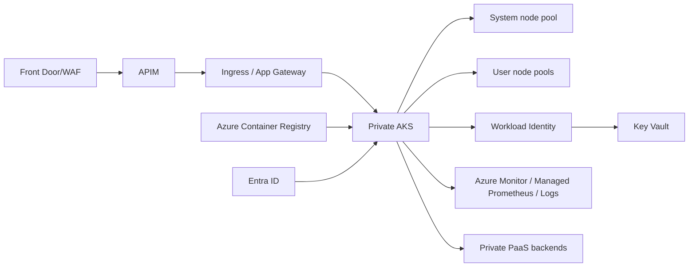

# Itération 4 — AKS

## Objectif

Définir une plateforme Kubernetes managée Azure pour des workloads bancaires conteneurisés avec sécurité, résilience, observabilité et maîtrise des coûts.

## Choix MayaBank

**AKS Standard** est retenu comme architecture de référence pour la cible régulée car il permet de contrôler finement réseau, node pools, ingress/egress, policies et intégrations. AKS Automatic reste une alternative pour des workloads moins contraints.

## Architecture cible

## Baseline

- API server privé ou accès fortement restreint selon scénario.
- Microsoft Entra integration + Azure RBAC/Kubernetes RBAC.
- Workload Identity + OIDC issuer.
- CNI adapté au plan IP ; Azure CNI Overlay à évaluer pour limiter la consommation d'adresses.
- system node pool séparé des user node pools.
- autoscaling des nodes et HPA/KEDA selon workload.
- requests/limits, PodDisruptionBudgets et topology spread.
- Network Policies.
- ACR privé et contrôle de provenance des images.
- Azure Policy for Kubernetes / admission controls selon politique entreprise.
- secrets via Key Vault CSI ou identité directe vers le service.
- monitoring cluster + workload avec logs, métriques, traces OpenTelemetry.
- stratégie d'upgrade, maintenance windows et version skew documentées.

## Haute disponibilité

En production :
- node pools distribués sur zones lorsque disponibles ;
- plusieurs replicas par service critique ;
- PDB ;
- dépendances PaaS configurées pour le niveau de résilience requis ;
- pour les workloads les plus critiques, second cluster dans une autre région avec routage global.

## Comparaison OpenShift / AKS

| OpenShift | AKS/Azure |
|---|---|
| Project | Namespace |
| Route | Ingress / Application Gateway / Gateway API selon choix |
| SCC | Pod Security + admission/policies |
| OperatorHub | Operators/Helm/add-ons |
| OpenShift GitOps | Flux/Argo CD/GitHub Actions selon standard |
| ImageStream | ACR + Kubernetes image references |

## LAB 04

Le lab AKS est **à la demande**, car les nodes sont facturés. Il doit :
1. créer réseau + AKS ;
2. activer Entra/Workload Identity ;
3. déployer une application minimale ;
4. tester HPA et interruption d'un pod ;
5. collecter logs/métriques ;
6. détruire immédiatement le cluster.

## Questions de soutenance

- Pourquoi AKS Standard plutôt qu'Automatic ici ?
- Comment sécuriser l'API server ?
- Comment un pod accède-t-il à Key Vault sans secret ?
- Comment gérer upgrades et PDB ?
- Comment concevoir un AKS multi-région ?

## Definition of Done

Architecture, choix réseau/identité, sécurité, scaling, observabilité, HA, comparaison OpenShift, lab et destroy documentés.
