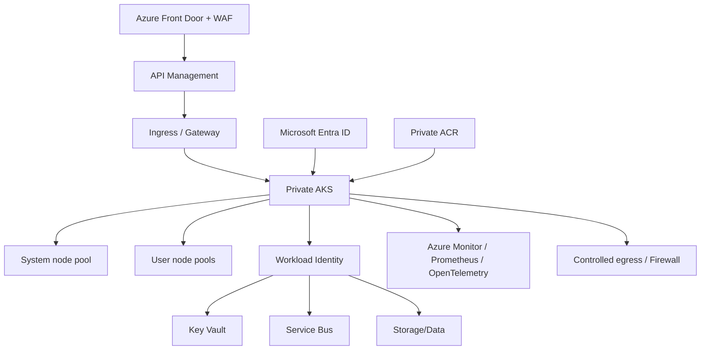

# MayaBank AKS — Reference Baseline 2026

## Références publiques retenues

MayaBank s'appuie sur deux références complémentaires :

- `Azure/AKS-Landing-Zone-Accelerator` pour l'intégration d'AKS dans une Application Landing Zone Azure ;
- `mspnp/aks-baseline` pour les choix de conception et de sécurisation du cluster.

Le dépôt MayaBank ne copie pas ces implémentations : il documente les décisions propres au contexte bancaire et conserve un lab court, destructible et contrôlé.

## Architecture cible



## Décisions structurantes

| Domaine | Choix cible | Justification |
|---|---|---|
| API server | privé / accès fortement restreint | réduit l'exposition du control plane |
| Identité humaine | Entra ID + RBAC | centralise authentification et autorisation |
| Identité workload | OIDC + Workload Identity | évite les secrets Azure statiques dans Kubernetes |
| Node pools | system séparé des workloads | isolation et maintenance |
| Réseau | Azure CNI selon contraintes IP, Overlay à évaluer | contrôle du plan IP et scalabilité |
| Images | ACR privé | provenance et gouvernance des images |
| Secrets | Key Vault CSI ou accès direct par identité | rotation et suppression des secrets statiques |
| GitOps | Flux/Argo CD selon standard entreprise | état déclaratif et auditabilité |
| Policy | Azure Policy/admission + Pod Security | garde-fous de plateforme |
| Observabilité | métriques, logs, traces, correlation ID | exploitation et incident management |

## Node pools

### System pool

- réservé aux composants système ;
- dimensionné pour survivre à une maintenance contrôlée ;
- autoscaling encadré ;
- restrictions de scheduling adaptées.

### User pools

Séparer lorsqu'une frontière justifie la complexité :

- workloads paiements critiques ;
- workloads batch ;
- besoins mémoire/CPU spécifiques ;
- isolation réglementaire ou opérationnelle.

La multiplication des pools sans besoin démontré est évitée.

## Disponibilité

Pour les services de paiement critiques :

- plusieurs replicas ;
- répartition inter-zones lorsque disponible ;
- `PodDisruptionBudget` ;
- `topologySpreadConstraints` ou anti-affinité selon besoin ;
- requests/limits réalistes ;
- probes de readiness/liveness/startup ;
- capacité de montée en charge testée.

AKS n'est qu'un maillon : Service Bus, bases, DNS, ingress et identités doivent avoir une résilience cohérente avec le RTO/RPO métier.

## Upgrade et lifecycle

Avant mise à niveau :

1. vérifier versions supportées et add-ons ;
2. valider PDB et capacité de surge ;
3. tester en NON-PROD ;
4. vérifier compatibilité Kubernetes/API dépréciées ;
5. exécuter upgrade contrôlé ;
6. valider SLO et transactions synthétiques ;
7. conserver les preuves.

## Sécurité runtime

Baseline :

- conteneurs non-root lorsque possible ;
- filesystem read-only lorsque compatible ;
- capabilities minimales ;
- images scannées ;
- NetworkPolicies ;
- namespaces et quotas ;
- admission policies ;
- secrets hors manifests Git ;
- egress explicite pour les workloads sensibles.

## GitOps

```text
Git
 |
Pull Request + quality gates
 |
GitOps controller
 |
AKS
 |
Desired state reconciliation
```

Le pipeline build publie l'image ; GitOps déploie la configuration. Les responsabilités build et deploy restent séparables.

## Ce que le lab doit prouver

Le lab n'est considéré comme exécuté que si `evidence/` contient :

- version AKS/Kubernetes ;
- node pools ;
- `kubectl get nodes -o wide` ;
- application à 2 replicas ;
- PDB et HPA ;
- Workload Identity fonctionnelle ;
- test négatif sans identité ;
- métriques/logs observés ;
- suppression d'un pod avec reprise ;
- preuve de destruction des ressources facturées.

## Limite actuelle

La conception I3 est finalisée dans Git. Le déploiement Azure réel reste volontairement non déclaré tant qu'aucun `apply` dans un abonnement Azure et aucune preuve d'exécution n'ont été produits.
