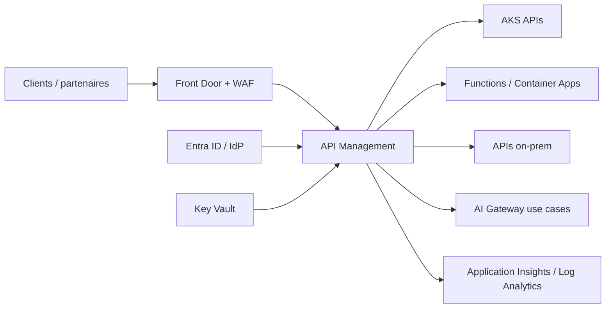

# Itération 5 — API Management

## Objectif

Construire une couche d'exposition et de gouvernance des API pour MayaBank : sécurité, versioning, quotas, observabilité, isolation réseau et cycle de vie API.

## Cible entreprise

Pour les API bancaires nécessitant isolation complète, la cible privilégie **Azure API Management Premium v2** avec injection VNet. Standard v2 reste une option pour des API de production nécessitant l'accès sortant à des backends privés sans isolation complète de la gateway.

## Capacités à maîtriser

- Products, APIs, operations, subscriptions.
- OpenAPI et versioning/revisions.
- OAuth2/OIDC et `validate-jwt`.
- mTLS lorsque requis pour partenaires.
- quotas, rate-limit, spike protection.
- transformation headers/body avec prudence.
- backend pools et résilience.
- Named Values adossées à Key Vault.
- private networking, Private Endpoint ou VNet injection selon SKU.
- diagnostics, correlation IDs et logs.
- séparation gateway / portail / management plane.

## Policies minimales

1. validation JWT ;
2. correlation ID ;
3. rate limiting ;
4. suppression des headers sensibles ;
5. timeout/retry uniquement lorsque l'opération est sûre ;
6. journalisation sans données bancaires sensibles ;
7. politique CORS explicite pour les APIs web.

## API lifecycle

`Design -> Review -> Security -> Publish -> Observe -> Version -> Deprecate -> Retire`

Les contrats OpenAPI doivent être versionnés dans Git. Les policies doivent être traitées comme du code et promues par environnement.

## LAB 05

Pour limiter le coût :
- ne pas créer Premium v2 en permanence ;
- utiliser une SKU de développement/consumption adaptée aux fonctionnalités testées, ou valider les policies hors déploiement quand une fonctionnalité réseau exige Premium v2 ;
- importer une API de démonstration ;
- appliquer `validate-jwt`, rate-limit et correlation ID ;
- exécuter tests positifs/négatifs ;
- détruire l'instance après le lab.

## Questions de soutenance

- APIM vs ingress Kubernetes ?
- Standard v2 vs Premium v2 ?
- Où placer Front Door et WAF ?
- Comment sécuriser une API partenaire ?
- Comment versionner policies et OpenAPI ?

## Definition of Done

Architecture, sécurité, réseau, policies, lifecycle, observabilité, stratégie de coût et lab documentés.
