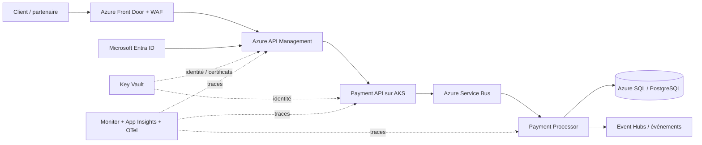
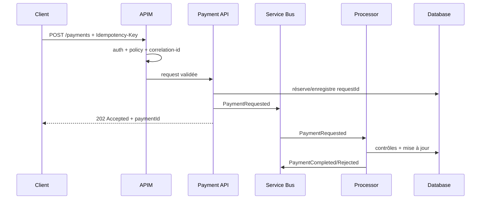

# MayaBank — Payment API Architecture

## Objectif métier

Exposer des services de paiement de manière sécurisée à des canaux internes, applications mobiles/web et partenaires, tout en découplant l'exposition API du traitement asynchrone.

## Architecture cible

## Responsabilités

### Azure Front Door + WAF

- point d'entrée global lorsque le scénario le nécessite ;
- protection WAF ;
- routage vers les endpoints publiés ;
- aucune logique métier.

### API Management

- authentification/autorisation d'entrée ;
- validation des contrats et headers ;
- quotas/rate limiting ;
- correlation ID ;
- transformation contrôlée ;
- observabilité ;
- versioning d'API ;
- découplage consommateurs/backends.

### Payment API

- valide les règles synchrones ;
- crée une commande de paiement/idempotency key ;
- publie la commande dans le bus ;
- retourne un identifiant et un statut initial ;
- ne bloque pas inutilement l'appel HTTP pendant tout le traitement bancaire.

### Payment Processor

- consomme la commande ;
- exécute les contrôles métier ;
- applique retry/backoff ;
- garantit l'idempotence ;
- persiste l'état ;
- publie les événements métier.

## Flux de création

## Contrat d'idempotence

Pour `POST /payments` :

- le consommateur envoie `Idempotency-Key` ;
- la clé est liée à l'identité du consommateur et au payload canonique ;
- une répétition identique retourne le même résultat logique ;
- une même clé avec un payload différent est rejetée ;
- la durée de rétention est définie par le produit et les contraintes métier.

## Sécurité

- OAuth2/OIDC selon type de client ;
- mTLS pour partenaires lorsque l'exigence le justifie ;
- backend privé ;
- Managed Identity / Workload Identity ;
- Key Vault pour certificats/secrets résiduels ;
- pas de données bancaires sensibles dans les logs ;
- rate limiting par consommateur/produit ;
- validation stricte des tailles et formats.

## Headers standards MayaBank

| Header | Rôle |
|---|---|
| `X-Correlation-ID` | traçabilité bout en bout |
| `Idempotency-Key` | déduplication logique des créations |
| `traceparent` | propagation W3C de trace |
| `Authorization` | jeton OAuth2/OIDC |

## Codes principaux

| Code | Usage |
|---|---|
| 202 | commande acceptée pour traitement |
| 400 | contrat invalide |
| 401/403 | authentification/autorisation |
| 409 | conflit d'idempotence/état |
| 429 | quota/rate limit |
| 5xx | erreur technique ; ne signifie pas automatiquement que le paiement n'a pas été traité |

## Point d'architecture critique

Sur un paiement, un timeout HTTP n'est jamais une preuve d'échec métier. Le client doit pouvoir interroger `GET /payments/{paymentId}` ou utiliser un mécanisme de notification, plutôt que rejouer aveuglément la transaction.

## Référence

L'architecture s'inspire du modèle `Azure/apim-landing-zone-accelerator` pour l'intégration d'APIM dans une Landing Zone, adapté ici au domaine paiement MayaBank.
