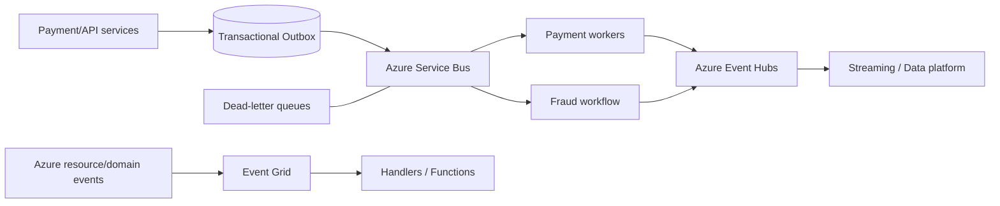

# Itération 6 — Event-Driven Architecture

## Objectif

Choisir et combiner les services de messaging/eventing Azure selon la sémantique métier, sans confondre file fiable, diffusion d'événements et streaming.

## Architecture cible

## Règle de choix

| Besoin | Service principal |
|---|---|
| Commandes métier, files fiables, transactions, DLQ | Service Bus |
| Topics/subscriptions avec traitement métier | Service Bus Topics |
| Streaming haute volumétrie / télémétrie / événements | Event Hubs |
| Notification réactive et fan-out d'événements | Event Grid |

## Patterns obligatoires

- Idempotent Consumer.
- Transactional Outbox pour éviter le dual write application + broker.
- Retry borné avec backoff.
- Dead-letter queue avec procédure de reprise.
- Correlation ID / traceparent propagé de bout en bout.
- Schema versioning et compatibilité ascendante.
- Partition key choisie selon ordering requis.
- At-least-once assumé et traité ; ne jamais promettre exactement-once de bout en bout sans preuve.

## Paiement — exemple

`PaymentRequested -> FraudCheckRequested -> PaymentAuthorized -> ClearingRequested -> PaymentCompleted`

Chaque transition critique doit être traçable. Un replay ne doit jamais débiter deux fois un client : l'idempotence métier s'appuie sur un identifiant de paiement stable.

## Sécurité

- Managed Identity quand supporté.
- Private Endpoints en production sensible.
- RBAC séparé send/listen/manage.
- Pas de connection strings dans Git.
- Diagnostic logs et métriques sur backlog, DLQ et throttling.

## LAB 06

Construire un petit flux producteur/consommateur :
1. message avec `paymentId` ;
2. consommateur idempotent ;
3. simulation d'échec ;
4. retry ;
5. DLQ ;
6. rejeu contrôlé ;
7. destruction des namespaces après validation.

## Questions de soutenance

- Service Bus vs Event Hubs ?
- Pourquoi l'Outbox ?
- Comment garantir qu'un paiement n'est pas traité deux fois ?
- Que fait-on d'une DLQ qui grossit ?
- Comment versionner les événements ?

## Definition of Done

Choix des services, patterns de fiabilité, sécurité, observabilité, cas paiement et lab de panne/replay documentés.
