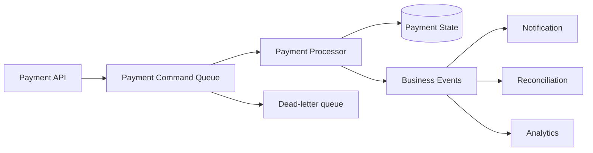
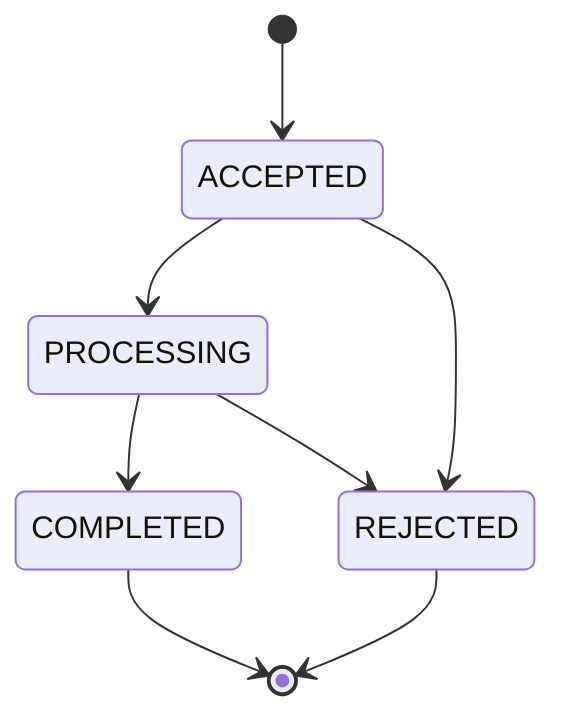

# MayaBank — Payment Processing Event-Driven Pattern

## Objectif

Découpler l'acceptation d'une demande de paiement du traitement métier, absorber les pointes de charge et rendre les reprises contrôlables sans créer de doubles paiements.

## Chaîne logique



## Message de commande

Champs minimaux recommandés :

```json
{
  "messageId": "uuid",
  "correlationId": "uuid-or-client-id",
  "paymentId": "uuid",
  "idempotencyKey": "client-key",
  "eventType": "PaymentRequested",
  "schemaVersion": "1.0",
  "occurredAt": "ISO-8601",
  "payload": {}
}
```

Aucune donnée sensible inutile ne doit être dupliquée dans les messages ou logs.

## Idempotence

Le processor doit supposer une livraison **au moins une fois**. Il vérifie donc un identifiant stable avant toute action non réversible.

Pseudo-flux :

```text
receive message
  -> check messageId/paymentId/idempotencyKey
  -> already processed ? return previous outcome / ack
  -> acquire logical processing guard
  -> execute business step
  -> persist state atomically where possible
  -> emit outcome event
  -> mark processed
  -> ack
```

L'« exactly once » n'est pas supposé magiquement fourni par le bus : la cohérence est conçue au niveau applicatif et transactionnel.

## Retry

Classer les erreurs :

| Type | Exemple | Action |
|---|---|---|
| transitoire | timeout dépendance | retry avec backoff/jitter |
| throttling | 429 | respecter délai/backoff |
| fonctionnelle | compte invalide | pas de retry technique, résultat REJECTED |
| poison message | contrat impossible à traiter | dead-letter |
| dépendance indisponible longue | panne aval | retry borné puis DLQ/parking selon stratégie |

Les retries doivent être bornés. Un retry infini transforme une panne en saturation.

## Dead-letter queue

Chaque message DLQ doit conserver suffisamment de contexte pour :

- identifier le message original ;
- connaître le nombre/timing des tentatives ;
- comprendre la cause ;
- retrouver la transaction métier ;
- décider `replay`, `repair`, `reject` ou escalade manuelle.

Un runbook définit qui peut rejouer un paiement et avec quels contrôles.

## Ordering

L'ordre global n'est pas requis par défaut. Lorsque plusieurs événements d'un même paiement doivent être ordonnés, utiliser une clé/session/partition cohérente avec le service retenu et conserver une machine d'état capable de rejeter les transitions invalides.

## Machine d'état de référence



Les transitions impossibles doivent être journalisées et bloquées.

## Outbox / cohérence DB-message

Lorsque la mise à jour de la base et la publication d'un événement doivent rester cohérentes, évaluer le pattern **Transactional Outbox** :

1. transaction DB : état métier + ligne outbox ;
2. publisher lit l'outbox ;
3. publie l'événement ;
4. marque l'outbox comme envoyée ;
5. consommateurs restent idempotents.

## Observabilité

Tous les composants propagent :

- `paymentId` ;
- `correlationId` ;
- `messageId` ;
- trace W3C lorsque possible.

Mesures essentielles : profondeur de queue, âge du message le plus ancien, taux de retry, DLQ, latence end-to-end, taux de rejet fonctionnel, taux d'erreur technique et temps de traitement.

## Tests obligatoires

- même message livré deux fois ;
- timeout du processor après persistance mais avant ack ;
- indisponibilité temporaire de la base ;
- poison message ;
- DLQ puis replay contrôlé ;
- messages hors ordre ;
- perte d'un pod processor pendant un traitement.
