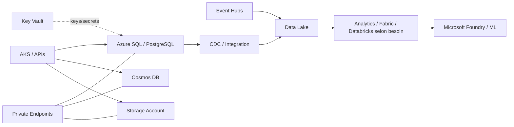

# Itération 7 — Data Architecture

## Objectif

Définir une architecture data Azure où le choix du service dépend du modèle de données, des transactions, de la latence, du volume, du PRA et du coût.

## Vue cible

## Guide de choix

| Besoin | Option à étudier |
|---|---|
| Transactions relationnelles Microsoft SQL | Azure SQL |
| PostgreSQL compatible managé | Azure Database for PostgreSQL |
| Documents / distribution globale / faible latence | Cosmos DB |
| Objets, fichiers, archives | Blob Storage |
| Lake / analytique | ADLS Gen2 |

Le choix n'est jamais fondé uniquement sur le service préféré de l'équipe.

## Principes banque

- classification des données avant architecture ;
- chiffrement en transit et au repos ;
- accès réseau privé lorsque requis ;
- Managed Identity privilégiée ;
- séparation données de production / analytics ;
- backup et restauration réellement testés ;
- RPO/RTO définis par domaine métier ;
- rétention et purge alignées avec exigences métier/réglementaires ;
- logs sans exposition de données sensibles ;
- stratégie de clés CMK uniquement si le besoin le justifie.

## Consistance

Pour chaque donnée, documenter :
- source of truth ;
- niveau de consistance ;
- concurrence ;
- idempotence ;
- stratégie de réplication ;
- stratégie de sauvegarde ;
- responsabilité de restauration.

## LAB 07 — économique

Le lab de base utilise Storage Account/Blob pour travailler :
1. private-by-design dans la configuration cible ;
2. RBAC ;
3. lifecycle management ;
4. versioning/rétention selon scénario ;
5. accès par identité ;
6. destruction.

Les bases managées plus coûteuses sont déployées ponctuellement uniquement pour les exercices correspondants.

## Questions de soutenance

- Azure SQL vs PostgreSQL vs Cosmos DB ?
- Backup n'est pas PRA : pourquoi ?
- Que change Private Endpoint pour DNS ?
- Comment dimensionner une base sans surprovisionner ?
- Comment isoler production et analytics ?

## Definition of Done

Matrice de choix, sécurité, cycle de vie, sauvegarde/PRA, réseau privé et lab économique documentés.
