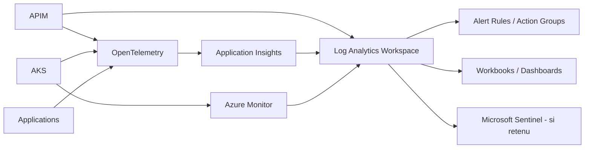

# Itération 8 — Observability

## Objectif

Rendre la plateforme exploitable : logs, métriques, traces, SLI/SLO, alertes et corrélation de bout en bout.

## Architecture cible

## Les quatre signaux

- Latence.
- Trafic.
- Erreurs.
- Saturation.

Ajouter les signaux métier : paiements reçus, autorisés, refusés, en attente, DLQ, temps de bout en bout.

## SLI/SLO exemple paiement

- disponibilité API paiement ;
- P95/P99 de latence ;
- taux d'erreur technique ;
- taux de messages en DLQ ;
- délai `PaymentRequested -> PaymentCompleted` ;
- backlog Service Bus/Event Hubs.

Un SLO doit conduire à une action opérationnelle ; éviter les dashboards sans objectif.

## Corrélation

Propager `traceparent`, correlation ID et identifiant métier non sensible entre Front Door/APIM, AKS, Service Bus/Event Hubs et services backend.

Ne jamais mettre PAN, secrets, tokens ou données sensibles en clair dans les logs.

## Alerting

- alertes symptom-based prioritaires ;
- seuils statiques seulement si pertinents ;
- alertes de capacité et coût ;
- runbook associé à chaque alerte critique ;
- déduplication et réduction du bruit.

## Rétention et coût

Les logs ont un coût. Définir par catégorie :
- niveau de criticité ;
- durée de conservation ;
- sampling ;
- archive ;
- accès audit.

## LAB 08

Déployer un Log Analytics Workspace temporaire et une application minimale ou réutiliser un workload existant :
1. produire logs/métriques/traces ;
2. construire 3 requêtes KQL ;
3. déclencher une alerte ;
4. vérifier la corrélation ;
5. supprimer les ressources après export des résultats utiles.

## Questions de soutenance

- Monitoring vs observability ?
- Pourquoi OpenTelemetry ?
- Comment définir un SLO pertinent ?
- Comment éviter une facture Log Analytics excessive ?
- Quels champs interdire dans les logs bancaires ?

## Definition of Done

Architecture de collecte, SLI/SLO, corrélation, KQL, alerting, rétention, coût et lab documentés.
