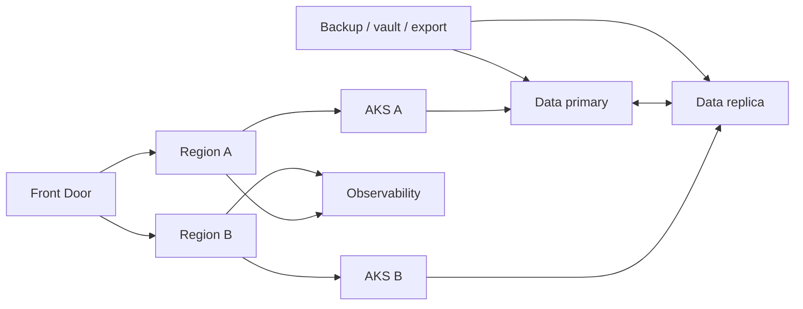

# Itération 9 — HA / DR

## Objectif

Concevoir la continuité de service à partir des besoins métier : tolérance aux pannes locales, reprise régionale, sauvegarde, restauration et exercices réguliers.

## Principes

- HA traite les pannes dans la région ; DR traite la perte d'une région ou d'un service majeur.
- Backup n'est pas DR.
- RTO/RPO sont définis par capacité métier, pas par préférence technique.
- Une architecture multi-région sans test de bascule n'est pas un PRA opérationnel.

## Classification MayaBank

| Classe | Exemple | RTO cible pédagogique | RPO cible pédagogique |
|---|---|---:|---:|
| C1 critique | Paiement / autorisation | <= 30 min | <= 5 min |
| C2 important | API partenaires non critique | <= 4 h | <= 1 h |
| C3 support | Reporting interne | <= 24 h | <= 24 h |

Ces valeurs sont des hypothèses de formation à faire valider par le métier.

## Architecture C1

## Décisions par composant

Pour chaque service :
- zone redundancy ;
- regional redundancy ;
- réplication ;
- backup ;
- ordre de redémarrage ;
- dépendances DNS/certificats/identité ;
- méthode de failover/failback ;
- preuve de restauration.

## Exercices

1. suppression d'un pod ;
2. perte d'un node ;
3. indisponibilité d'un backend ;
4. backlog messaging ;
5. restauration d'un objet/donnée ;
6. simulation de perte régionale sur papier puis environnement dédié ;
7. mesure réelle du RTO/RPO.

## Runbook minimum

`Detect -> Decide -> Declare incident -> Failover -> Validate -> Communicate -> Operate degraded -> Failback -> Postmortem`

## LAB 09

Ne pas maintenir deux régions coûteuses en permanence. Utiliser :
- tests de résilience AKS locaux ;
- sauvegarde/restauration sur ressources peu coûteuses ;
- exercice multi-région planifié puis destroy ;
- table de dépendances et runbook exécuté chronométré.

## Questions de soutenance

- SLA vs SLO vs RTO/RPO ?
- Active/active vs active/passive ?
- Pourquoi un backup réussi ne prouve-t-il rien sans restore test ?
- Comment éviter le split-brain ?
- Que faut-il tester en plus des ressources applicatives ?

## Definition of Done

Classification, RTO/RPO, architectures HA/DR, runbooks, tests de restauration et stratégie de failover/failback documentés.
