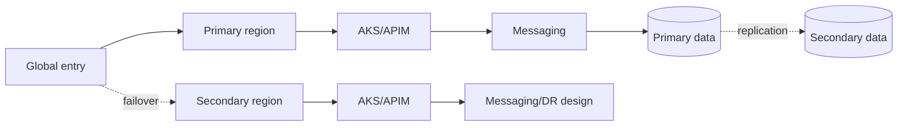

# MayaBank — Service Resilience Matrix

## Principe

Les valeurs ci-dessous sont des **objectifs d'architecture de référence pour le POC MayaBank**. Elles ne constituent pas des garanties Azure ni des engagements métier. Dans une vraie banque, RTO/RPO doivent être validés par le métier, le BIA, la conformité et l'exploitation avant le choix des services.

| Composant | Criticité | RTO cible POC | RPO cible POC | Stratégie d'architecture |
|---|---|---:|---:|---|
| Front Door/WAF | critique | minutes | n/a | service global, configuration IaC |
| API Management | critique | < 30 min | configuration | configuration versionnée, stratégie régionale selon tier |
| Payment API / AKS | critique | < 15 min | stateless | multi-replicas, zones, second cluster/région pour cible critique |
| Payment Processor | critique | < 15 min | message-driven | replicas, reprise par queue, consommateurs idempotents |
| Service Bus | critique | < 30 min | à valider | design namespace/DR adapté au tier et au besoin métier |
| Payment Database | critique | < 30 min | minutes ou mieux selon besoin | HA intra-région + réplication/failover inter-région selon moteur |
| Blob/Data | important | heures/minutes selon donnée | selon classification | ZRS/GZRS/GRS ou autre stratégie validée |
| Observability | important | < 1 h | tolérance définie | collecte redondante, IaC, rétention adaptée |
| Git/IaC | important | < 4 h | commits | Git comme source de vérité, state protégé/versionné |

## Niveaux de panne

1. panne d'un pod/processus ;
2. panne d'un node ;
3. panne d'une zone ;
4. panne d'un service dépendant ;
5. panne régionale ;
6. erreur humaine/configuration ;
7. corruption ou suppression de données ;
8. compromission de sécurité.

Une architecture « multi-région » ne couvre pas automatiquement les scénarios 6 à 8 : sauvegarde, versioning, immutabilité, séparation des rôles et procédures de restauration restent nécessaires.

## Stratégie paiement

Le mode active/active ou active/passive est choisi service par service. Il ne faut pas imposer active/active si le modèle de données, le coût ou la cohérence métier ne le justifient pas.

## Critères de décision

Pour chaque composant :

- perte maximale acceptable ;
- durée maximale d'indisponibilité ;
- dépendances ;
- support zonal/régional du service ;
- cohérence requise ;
- procédure de failover/failback ;
- coût du standby ;
- fréquence et preuve des tests de PRA.

## Tests PRA minimaux

- arrêt d'un pod ;
- perte d'un node ;
- indisponibilité simulée d'une dépendance ;
- consommation de messages après redémarrage ;
- restauration d'une sauvegarde ;
- bascule régionale documentée ou simulée ;
- failback ;
- mesure réelle RTO/RPO pendant le test.
