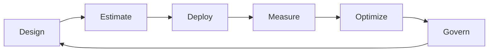

# Itération 10 — FinOps / GreenOps

## Objectif

Intégrer coût et sobriété dans les décisions d'architecture, pas après le déploiement.

## Principes

- coût visible par workload/environnement ;
- tags obligatoires et ownership clair ;
- budgets et alertes ;
- rightsizing continu ;
- autoscaling ;
- suppression des ressources orphelines ;
- arrêt/destruction des environnements de lab ;
- stockage avec lifecycle ;
- rétention de logs proportionnée ;
- choix de région et de service fondé sur exigences, coût, latence, résilience et contraintes de données.

## Tags FinOps

`Application`, `Environment`, `Owner`, `CostCenter`, `Criticality`, `DataClassification`, `ManagedBy`, `ExpirationDate`.

## Boucle de pilotage

## Contrôles

- budget subscription/RG ;
- seuils d'alerte ;
- ressources sans tag ;
- ressources idle ;
- disques/IP orphelins ;
- surdimensionnement AKS ;
- rétention Log Analytics ;
- stockage hot inutile ;
- environnements non-prod allumés sans besoin ;
- services Premium uniquement si une exigence le justifie.

## GreenOps

GreenOps n'est pas un chiffre carbone inventé. Le dépôt documente les leviers mesurables :
- réduction du compute inutilisé ;
- augmentation du taux d'utilisation ;
- autoscaling ;
- extinction des environnements ;
- réduction des données stockées et transférées ;
- politiques de rétention ;
- architecture évitant la duplication inutile ;
- mesure via outils disponibles plutôt que conversion arbitraire coût -> CO2.

## Budget pédagogique

Objectif : rester autour d'un petit budget mensuel. Les services coûteux comme Firewall, Bastion, APIM Premium v2, AKS nodes multi-zone/multi-région et certaines bases doivent être créés uniquement pendant les labs qui les exigent puis détruits.

## LAB 10

1. relever le coût avant lab ;
2. déployer une ressource ;
3. vérifier tags ;
4. observer Cost Management ;
5. identifier optimisation ;
6. détruire ;
7. vérifier qu'aucune ressource facturable orpheline ne reste.

## Questions de soutenance

- Réservation ou autoscaling : comment arbitrer ?
- Comment allouer un coût partagé de plateforme ?
- Comment éviter les économies qui dégradent le RTO ?
- Quels leviers GreenOps sont réellement mesurables ?
- Pourquoi le tagging est-il une décision d'architecture ?

## Definition of Done

Tagging, budgets, allocation, optimisation, contrôles de ressources orphelines, stratégie GreenOps et routine de mesure documentés.
