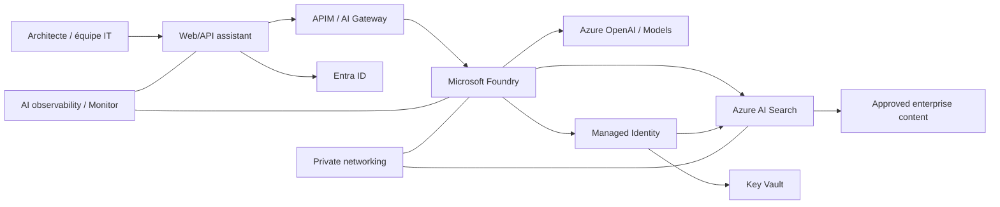

# Itération 11 — Microsoft Foundry / AI Platform

## Objectif

Définir une plateforme IA d'entreprise Azure sécurisée pour des cas de GenAI/RAG bancaires, avec gouvernance des données, identité, réseau privé, évaluation et observabilité.

> En 2026, la documentation Microsoft emploie **Microsoft Foundry** pour la plateforme précédemment connue comme Azure AI Foundry. Le dépôt utilise le nom actuel tout en conservant cette correspondance pour les recherches historiques.

## Cas MayaBank

Assistant d'architecture et d'exploitation : recherche dans les standards internes, ADR, dossiers d'architecture, runbooks et documentation technique, sans exposer les documents en dehors du périmètre autorisé.

## Architecture cible

## Sécurité

- Entra ID pour les utilisateurs.
- Managed Identity pour les workloads.
- Private networking/Private Endpoints lorsque les services et exigences le permettent.
- aucune clé modèle dans le code ;
- contrôle d'accès documentaire avant retrieval ;
- filtrage des données sensibles ;
- journalisation sans prompts contenant des secrets ;
- politique de conservation des conversations ;
- défense contre prompt injection et exfiltration indirecte.

## RAG

Pipeline :
`Ingest -> Classify -> Chunk -> Embed -> Index -> Retrieve -> Authorize -> Generate -> Cite -> Evaluate`.

Le contrôle d'autorisation ne doit pas être supprimé sous prétexte que le document est déjà indexé.

## Évaluation

Mesurer au minimum :
- groundedness/fidélité aux sources ;
- pertinence ;
- taux d'hallucination observé ;
- sécurité ;
- latence ;
- coût par requête/use case ;
- taux d'escalade vers humain.

## AI Gateway

APIM peut fournir des politiques communes devant les endpoints IA : authentification, quotas, journalisation contrôlée, routage et gouvernance. Ne pas confondre gateway et mécanisme d'évaluation du modèle.

## LAB 11

Mode budget réduit :
1. petit corpus documentaire fictif ;
2. index de recherche minimal ;
3. endpoint modèle disponible dans le tenant ;
4. identité managée ;
5. RAG avec citations ;
6. 20 questions de test ;
7. mesure latence/coût/qualité ;
8. suppression des ressources facturables.

Si aucun modèle n'est autorisé dans l'abonnement, le lab doit rester reproductible avec mocks et conserver l'architecture cible.

## Questions de soutenance

- RAG vs fine-tuning ?
- Comment éviter qu'un utilisateur retrouve un document auquel il n'a pas droit ?
- Comment mesurer une hallucination ?
- Où mettre APIM dans une architecture GenAI ?
- Comment maîtriser coût/token et latence ?

## Definition of Done

Architecture Foundry, RAG, identité, réseau, sécurité, évaluation, observabilité, coûts et lab documentés.
