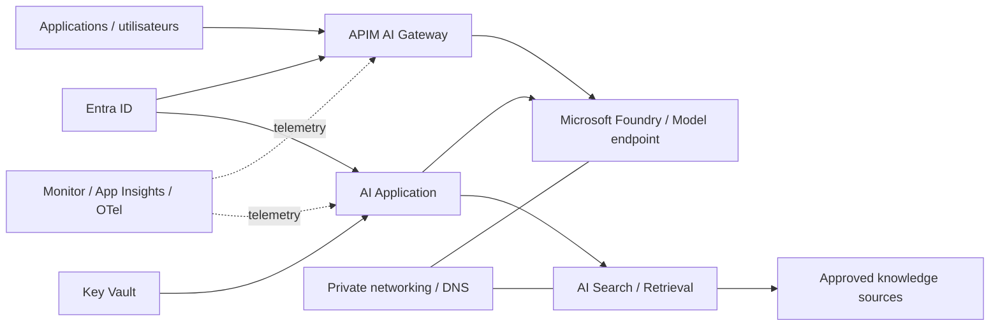

# MayaBank — Enterprise AI Landing Zone 2026

## Référence

Cette architecture s'aligne sur `Azure/AI-Landing-Zones` et sur les principes ALZ/AVM retenus par MayaBank. L'IA est un workload gouverné de la Landing Zone, pas une plateforme isolée des contrôles réseau, identité, sécurité et coûts.

## Architecture cible



## Principes

- identité managée/fédérée avant secrets ;
- données sensibles privées par défaut ;
- sources RAG autorisées et traçables ;
- séparation dev/test/prod ;
- modèles/endpoints gouvernés ;
- APIM comme gateway lorsque centraliser auth, quotas, observabilité ou routage de modèles apporte une valeur ;
- journalisation sans exposer prompts/données sensibles de manière indiscriminée ;
- coûts et quotas suivis par workload ;
- évaluation avant promotion en production.

## RAG bancaire

Pipeline logique :

```text
source documentaire approuvée
 -> ingestion contrôlée
 -> nettoyage/classification
 -> chunking
 -> index
 -> retrieval avec ACL lorsque nécessaire
 -> modèle
 -> réponse + références
```

Le modèle ne doit pas devenir un contournement des ACL documentaires. L'autorisation utilisateur doit être appliquée avant ou pendant le retrieval selon le design.

## AI Gateway

APIM peut fournir :

- authentification et autorisation ;
- quotas par consommateur ;
- observabilité ;
- routage vers plusieurs backends/modèles ;
- gestion centralisée de policies ;
- protection de l'interface publique.

Les policies IA spécifiques sont ajoutées uniquement après vérification de leur disponibilité dans le tier/région réellement utilisés.

## Risques à traiter

| Risque | Contrôle architectural |
|---|---|
| fuite de données | classification, private networking, DLP/processus, logs minimisés |
| prompt injection | filtrage, isolation des outils, validation des sources/actions |
| hallucination | RAG, citations, validation métier pour actions critiques |
| surconsommation | quotas, budgets, rate limiting, model routing |
| accès excessif | Entra/RBAC, ACL retrieval, managed identities |
| dépendance modèle | abstraction gateway, tests, stratégie de changement |
| dérive qualité | evals versionnées et critères de promotion |

## Evaluation gates

Avant production :

- jeu d'évaluation versionné ;
- qualité/réponses factuelles mesurées ;
- tests sécurité/adversarial adaptés ;
- tests de données sensibles ;
- latence ;
- coût par requête/scénario ;
- fallback documenté ;
- observabilité ;
- owner métier et technique.

## Séparation POC / cible entreprise

Le lab peut employer des endpoints publics ou une configuration simplifiée pour rester économique. La cible entreprise conserve Private Endpoints, réseau/DNS, gateway, sécurité et gouvernance appropriés. Toute simplification de lab doit être explicitement documentée.
