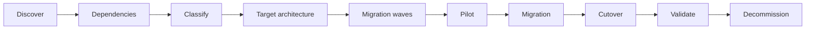

# Itération 12 — Migration on-prem / OpenShift vers Azure

## Objectif

Construire une trajectoire de migration réaliste sans transformer la migration en simple déplacement technique.

## Cas fil rouge

MayaBank possède :
- applications Java sur OpenShift/on-prem ;
- APIs ;
- Kafka/messaging ;
- bases relationnelles ;
- stockage objet/fichier ;
- contraintes réseau banque et PRA.

La cible utilise selon les domaines AKS, APIM, Service Bus/Event Hubs, services data Azure et Microsoft Foundry.

## Démarche

## 7R

- Rehost.
- Replatform.
- Refactor.
- Repurchase.
- Retire.
- Retain.
- Relocate selon technologie/scénario.

Pour chaque application, justifier le R choisi par coût, risque, délai, valeur métier et dette technique.

## Matrice exemple

| Composant | Source | Cible possible | Stratégie |
|---|---|---|---|
| Java stateless | OpenShift | AKS | Replatform |
| API Gateway | on-prem | APIM | Replatform |
| Kafka métier | Kafka | Kafka managé/maintenu ou Service Bus/Event Hubs selon sémantique | Décision par flux |
| DB relationnelle | Oracle/PostgreSQL/etc. | Azure managed DB ou maintien | Assessment détaillé |
| S3-like/object | on-prem | Blob/ADLS | Replatform |

Ne jamais remplacer Kafka par Event Hubs ou Service Bus uniquement parce que les services existent : analyser ordering, replay, consumer groups, transactions, retention et dépendances applicatives.

## Coexistence hybride

Pendant la migration :
- DNS et routage hybrides ;
- identité ;
- certificats ;
- observabilité de bout en bout ;
- synchronisation de données ;
- contrat API stable ;
- stratégie de rollback.

## Migration waves

1. fondations Azure ;
2. workload non critique pilote ;
3. services partagés ;
4. APIs et workloads stateless ;
5. messaging ;
6. data ;
7. workloads critiques ;
8. décommissionnement.

## Cutover

Checklist : freeze, sauvegarde, réplication à jour, DNS/route, certificats, smoke tests, tests métier, monitoring, décision Go/No-Go, rollback testé.

## LAB 12

Simuler une migration d'un microservice local/OpenShift vers AKS :
- container identique ;
- externalisation de configuration ;
- identité ;
- endpoint API ;
- logs/traces ;
- test avant/après ;
- rollback ;
- destroy Azure.

## Questions de soutenance

- Comment choisir entre rehost, replatform et refactor ?
- Comment migrer sans big bang ?
- Comment traiter une base très volumineuse ?
- Quand conserver Kafka ?
- Quels critères Go/No-Go au cutover ?

## Definition of Done

Assessment, 7R, dépendances, vagues, coexistence hybride, cutover/rollback, décommissionnement et lab pilote documentés.
