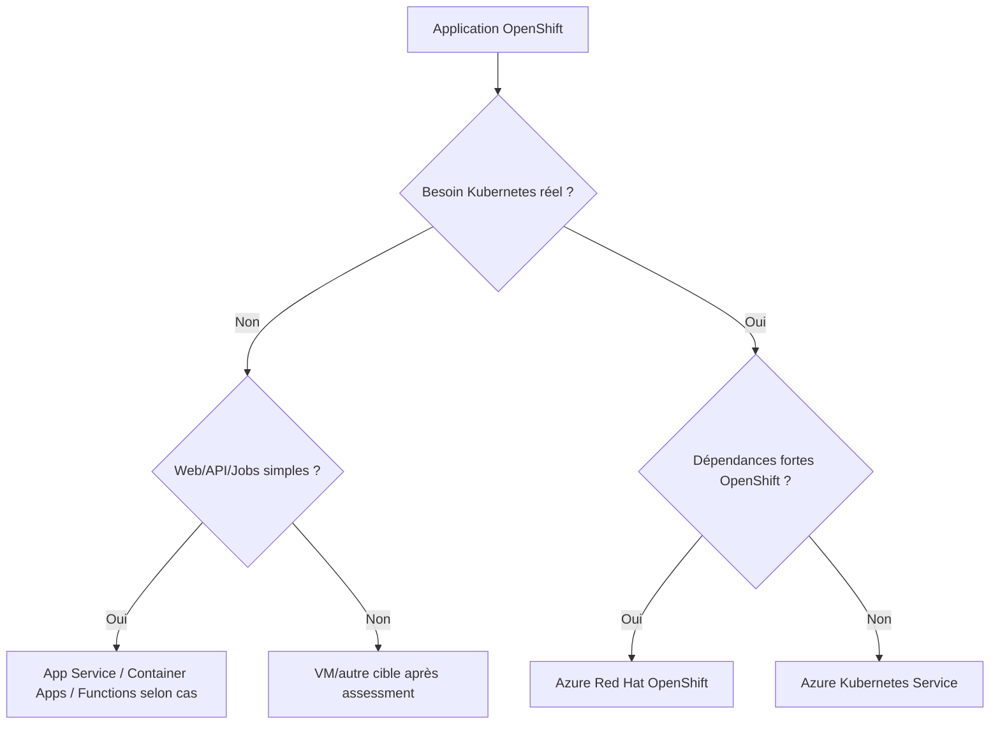

# MayaBank — OpenShift to Azure Decision Matrix

## Objectif

Une migration OpenShift vers Azure ne signifie pas automatiquement « convertir en AKS ». Chaque application est évaluée selon ses dépendances OpenShift, son besoin Kubernetes, son niveau de contrôle et le coût d'exploitation.

## Arbre de décision

## Matrice

| Critère | ARO | AKS | Container Apps / App Service |
|---|---|---|---|
| Compatibilité OpenShift | forte | migration/adaptation | refonte/modernisation |
| Kubernetes natif | oui | oui | abstrait/partiel |
| Ops plateforme | managée mais OpenShift | managée Kubernetes | fortement managée |
| SCC/Routes/Operators spécifiques | meilleure continuité | adaptation nécessaire | non applicable |
| besoin de contrôle K8s | élevé | élevé | faible/moyen |
| coût/complexité | généralement supérieur | modulable | souvent plus simple pour petits workloads |
| équipe déjà experte OpenShift | transition douce | montée en compétence AKS | changement de modèle |

## Assessment par application

Collecter :

- namespaces/projects ;
- Deployments/StatefulSets/Jobs ;
- Routes/Ingress ;
- SCC/Pod Security ;
- Operators/CRD ;
- stockage/PVC ;
- secrets/config ;
- dépendances réseau/DNS ;
- base/messaging ;
- observabilité ;
- exigences RTO/RPO ;
- consommation CPU/RAM réelle ;
- licences ;
- dépendances à des fonctions OpenShift spécifiques.

## Mapping courant

| OpenShift | Azure cible possible |
|---|---|
| Project | Namespace |
| Route | Ingress/Gateway/Application Gateway selon architecture |
| SCC | Pod Security + admission/policies |
| Image registry | ACR |
| OpenShift GitOps | Flux/Argo CD/GitHub Actions selon standard |
| OpenShift Monitoring | Azure Monitor/Managed Prometheus + OTel selon cible |
| Secret | Key Vault + Workload Identity/CSI |
| Operator | Operator compatible, Helm ou service Azure managé |

## Stratégies 6R adaptées

- **Rehost** : cas VM/legacy, faible changement ;
- **Replatform** : OpenShift vers ARO/AKS avec adaptations limitées ;
- **Refactor** : découpage/service managé/event-driven ;
- **Repurchase** : SaaS/produit ;
- **Retain** : reste on-premise pour contrainte justifiée ;
- **Retire** : application supprimée.

## Vagues de migration

1. applications stateless non critiques ;
2. services internes avec dépendances limitées ;
3. workloads intégrés ;
4. applications critiques ;
5. stateful/legacy complexes.

Chaque vague produit un retour d'expérience avant la suivante.

## Critères de sortie

Une application n'est pas « migrée » uniquement parce que ses pods démarrent. Vérifier :

- flux entrants/sortants ;
- identité ;
- secrets ;
- stockage ;
- observabilité ;
- sauvegarde/reprise ;
- performance ;
- sécurité ;
- coût ;
- exploitation/runbook ;
- test de rollback.

## Positionnement MayaBank

Pour le POC, AKS est la cible d'apprentissage principale afin de démontrer les compétences Azure natives. ARO reste une option d'architecture importante pour une banque souhaitant conserver l'écosystème OpenShift et réduire le risque de migration technique.
