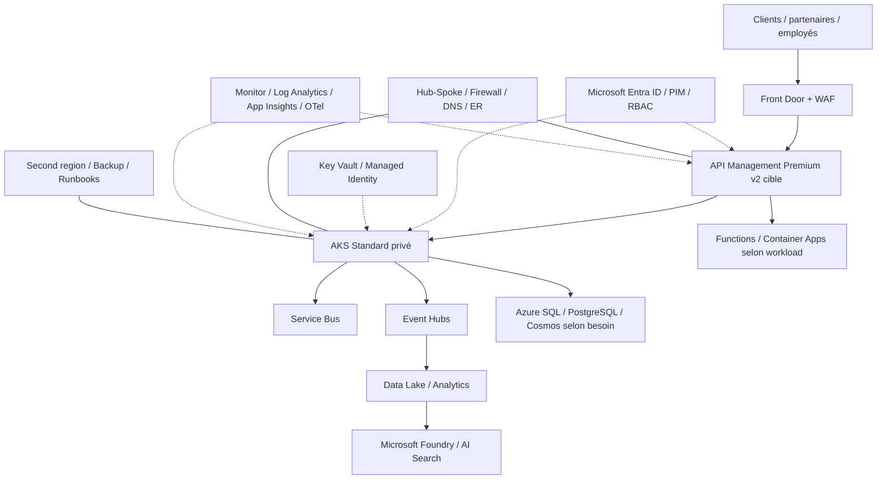

# Itération 13 — Soutenance Architecte Solution Azure

## Objectif

Transformer le dépôt technique en dossier de soutenance : expliquer le besoin, défendre les choix, présenter les risques, montrer les arbitrages et répondre aux objections.

## Trame 30 minutes

1. Contexte métier MayaBank — 2 min
2. NFR et contraintes — 3 min
3. Landing Zone et gouvernance — 3 min
4. Identité / sécurité — 3 min
5. Réseau hybride — 3 min
6. AKS / APIM / event-driven — 5 min
7. Data / observabilité — 3 min
8. HA/DR — 2 min
9. FinOps/GreenOps — 2 min
10. IA / Microsoft Foundry — 2 min
11. Migration et roadmap — 2 min

## Architecture de synthèse

## 15 décisions à savoir défendre

1. Landing Zone avant workloads.
2. Séparation Platform / Application Landing Zones.
3. Terraform + Azure Verified Modules.
4. Entra groups + Azure RBAC + PIM.
5. Managed Identity / Workload Identity plutôt que secrets statiques.
6. Hub-Spoke et réseau privé pour les services sensibles.
7. AKS Standard pour le scénario bancaire contrôlé.
8. APIM Premium v2 en cible pour isolation VNet complète.
9. Service Bus pour messaging métier fiable.
10. Event Hubs pour streaming.
11. Service data choisi selon besoin, pas par standard unique.
12. OpenTelemetry + Azure Monitor pour corrélation.
13. RTO/RPO métier avant choix HA/DR.
14. FinOps/GreenOps intégrés au design.
15. Microsoft Foundry sécurisé pour les use cases IA.

## Risques principaux

| Risque | Réponse architecturale |
|---|---|
| Explosion des coûts | budgets, tags, destroy labs, rightsizing |
| Complexité réseau privé | DNS centralisé, IP plan, standards Private Link |
| Privileges excessifs | PIM, groupes, scope minimum |
| Verrouillage technologique | contrats/API/events, ADR, abstraction utile seulement |
| Défaillance régionale | classification, multi-région ciblée, runbooks |
| Double traitement paiement | idempotence + outbox + clé métier |
| Fuite de données IA | authz documentaire, private access, évaluation |
| Logs sensibles | classification, redaction, règles de logging |

## Questions d'entretien — niveau architecte

### Gouvernance
- Comment organiser Management Groups et subscriptions dans une banque ?
- Quand créer une nouvelle subscription ?
- Policy vs RBAC : différence ?

### Sécurité
- Comment supprimer les secrets de CI/CD ?
- Pourquoi PIM ?
- Quelle différence entre Managed Identity et Workload Identity ?

### Réseau
- Hub-Spoke vs Virtual WAN ?
- Private Endpoint vs Service Endpoint ?
- Comment résoudre le DNS d'un Private Endpoint depuis on-prem ?

### AKS
- Pourquoi cluster privé ?
- Comment gérer upgrades, PDB, autoscaling et egress ?
- AKS vs OpenShift : quelles différences architecturales ?

### Intégration
- APIM vs ingress ?
- Service Bus vs Event Hubs ?
- Comment assurer idempotence et replay ?

### Résilience
- SLA vs SLO vs RTO/RPO ?
- Active/active ou active/passive ?
- Comment prouver un PRA ?

### FinOps
- Comment répartir les coûts d'une plateforme partagée ?
- Comment réduire les coûts sans casser les NFR ?

### IA
- RAG vs fine-tuning ?
- Comment empêcher un RAG de révéler un document interdit ?
- Comment mesurer qualité, coût et hallucinations ?

## Livrables finaux attendus

- HLD ;
- diagrammes ;
- matrice NFR ;
- ADR ;
- threat/risk register ;
- RTO/RPO ;
- stratégie de migration ;
- estimation de coût ;
- preuves de labs ;
- backlog de décisions ouvertes.

## Definition of Done

Le candidat doit pouvoir présenter l'architecture sans lire le dépôt, expliquer les alternatives rejetées, montrer au moins un lab exécuté par domaine majeur et répondre aux questions ci-dessus avec des arguments liés aux NFR.
