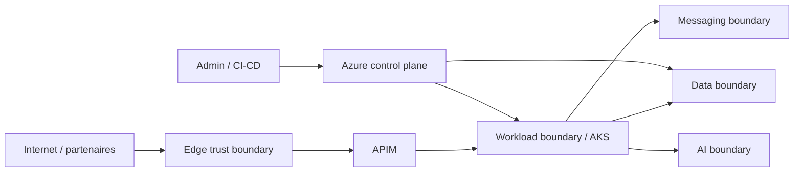

# Threat Model — MayaBank Azure

## Scope

Front Door/WAF, APIM, AKS, messaging, data services, Microsoft Foundry/RAG, identité et administration Azure.

## Trust boundaries

## STRIDE

### Spoofing
Risques : token volé, identité workload usurpée, partenaire non authentifié.

Contrôles : Entra ID, MFA/Conditional Access côté tenant, JWT/mTLS selon flux, Managed/Workload Identity, certificats gérés, PIM.

### Tampering
Risques : image modifiée, message paiement altéré, IaC non revue.

Contrôles : ACR et pipeline contrôlés, Git review, immutabilité/versioning, TLS, integrity checks, RBAC, Policy as Code.

### Repudiation
Risques : action d'administration ou paiement non traçable.

Contrôles : Activity Logs, correlation ID, audit applicatif, identités nominatives, PIM, horodatage et conservation adaptée.

### Information Disclosure
Risques : secret/log sensible, Storage public, Private Endpoint mal configuré, document RAG non autorisé.

Contrôles : Key Vault, private-by-default, redaction logs, classification, RBAC data plane, authz avant retrieval, encryption.

### Denial of Service
Risques : saturation API, AKS, broker, base, modèle IA ou quota.

Contrôles : WAF, rate limits, autoscaling, quotas, backpressure, DLQ, capacity tests, multi-zone/région selon criticité.

### Elevation of Privilege
Risques : Owner permanent, service principal trop large, pod obtenant des droits Azure excessifs.

Contrôles : PIM, least privilege, scopes minimum, workload identities par service, admission/policies, revues RBAC.

## Menaces spécifiques paiement

- duplicate/replay -> `paymentId` stable + idempotence ;
- message partiellement traité -> outbox/state machine ;
- ordering incorrect -> partition/session/key selon sémantique ;
- backend lent -> timeout, circuit breaker, workflow asynchrone lorsque possible.

## Menaces spécifiques IA

- prompt injection ;
- indirect prompt injection dans documents ;
- exfiltration de corpus ;
- cross-user data leakage ;
- tool abuse par agent ;
- hallucination présentée comme fait.

Contrôles : corpus approuvé, authz retrieval, séparation des outils, allow-list, validation des actions, citations, évaluation, human-in-the-loop pour actions sensibles.

## Validation

Le threat model doit produire des tests : token invalide, accès Key Vault refusé, ressource non autorisée, duplicate payment, prompt injection, document RAG interdit, rate limit et panne de dépendance.
